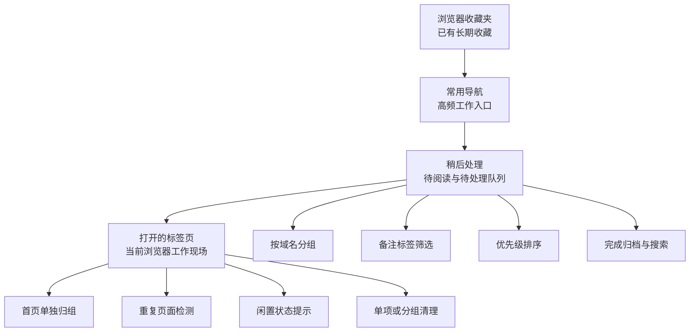
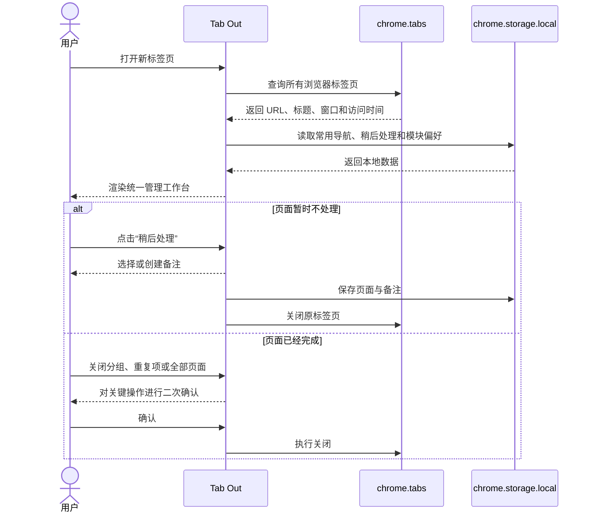
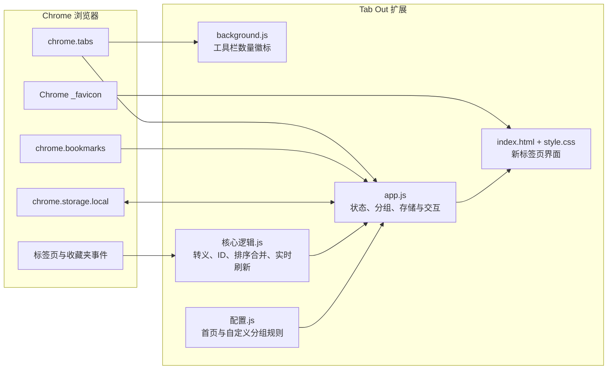
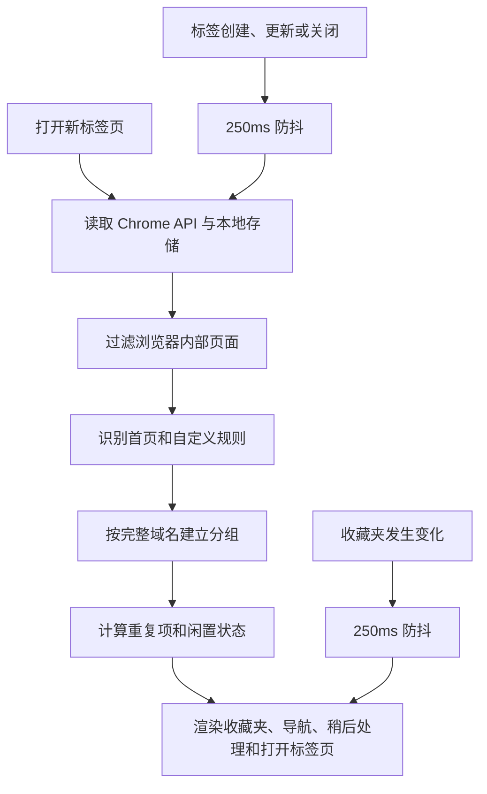

# Tab Out

一款面向高标签页负载场景的 Chrome 新标签页管理扩展。

Tab Out 把浏览器新标签页替换为一个本地工作台，将浏览器收藏夹、常用导航、稍后处理和当前打开的标签页集中到同一个页面。它不仅帮助你看见正在打开的内容，也提供保存、归类、排序、归档、查重和批量清理能力。

本项目基于 [Zara 的开源 Tab Out](https://github.com/zarazhangrui/tab-out) 持续演进。当前版本已经在中文化、信息架构、稍后处理、收藏夹、快捷导航、实时状态、数据安全和交互完整性等方面进行了较大扩展。

## 项目特点

- 纯 Chrome Manifest V3 扩展，无后端服务、无账号体系、无构建步骤
- 所有用户配置和稍后处理数据保存在 `chrome.storage.local`
- 不加载远程字体，不调用外部业务 API
- 网站图标通过 Chrome 原生 `_favicon` 能力读取
- 支持大量标签页、收藏夹和稍后处理内容的高密度展示
- 批量关闭、永久移除等关键操作均有二次确认
- 对网页标题等外部输入进行 HTML 转义，避免注入扩展页面
- 使用写入队列和 Web Lock 降低多个 Tab Out 页面同时操作时的数据覆盖风险

## 界面信息架构

页面按照从长期资产到当前任务的顺序组织：



四个模块的默认顺序为：

1. 浏览器收藏夹
2. 常用导航
3. 稍后处理
4. 打开的标签页

浏览器收藏夹、常用导航和稍后处理均支持收起、隐藏与恢复显示，模块状态会自动保存。

## 核心功能

### 1. 浏览器收藏夹

直接读取 Chrome 收藏夹，无需重复导入。

- 展示书签栏中的网页和文件夹
- 支持进入子文件夹并返回书签栏
- 默认展示前 10 项，可展开查看剩余内容
- 使用 Chrome 缓存中的网站图标
- 收藏夹发生新增、删除、修改、移动或重排时自动刷新
- 模块可独立收起或隐藏

### 2. 常用导航

将高频系统、文档、工作台和项目地址固定在新标签页。

- 添加、编辑和移除快捷入口
- 粘贴网址时自动补全 `https://`
- 自动从已打开标签页、浏览器收藏夹或域名推断名称
- 通过拖拽调整入口顺序
- 使用 5 列高密度网格展示，窄屏自动响应
- 快捷入口数据保存在本地

### 3. 稍后处理

稍后处理不是简单的书签清单，而是一个可以持续整理的待办队列。

#### 保存与备注

- 从打开的标签页点击书签按钮，将页面保存到稍后处理并关闭原标签页
- 保存时弹出备注选择框
- 可以选择同域名下已有备注，也可以创建新备注
- 没有填写备注时自动使用“默认”
- 点击单条内容的备注标签，可以重新划分到其他备注
- 备注支持按域名批量重命名
- 重命名为已有备注时自动合并到同一标签组

#### 分组与筛选

- 所有内容首先按域名分组
- 每个域名组内部使用多列布局展示
- 备注以标签 Chip 形式显示
- 点击备注即可筛选当前域名下的内容
- 每个标签显示内容数量，便于快速判断任务规模

#### 排序与归档

- 支持在每个域名组内拖拽调整优先级
- 排序状态下会禁用跳转、备注修改、勾选和移除，避免误操作
- 手动排序会持续保留，不提供一键清除入口
- 勾选完成后，内容进入归档区
- 归档区支持按标题或 URL 搜索
- 永久移除前需要二次确认

### 4. 打开的标签页

将当前所有可管理网页按域名整理为工作分组。

- 按完整域名分组，避免相似域名相互混淆
- Gmail、X、LinkedIn、GitHub、YouTube 等首页可进入“常用首页”分组
- 自定义规则可以合并子域名，或按路径拆分业务分组
- 同一 URL 打开多次时显示重复数量
- 一键关闭重复页面，并保留一份
- 点击页面标题可跨 Chrome 窗口跳转到原标签页
- 支持关闭单个页面、整个域名分组或全部网页
- 批量关闭前显示数量和二次确认
- 标签较多时在卡片内部滚动，避免整页被单个域名撑开
- `localhost` 页面额外显示端口，便于区分本地项目

### 5. 标签活跃度

Tab Out 使用 Chrome 提供的 `lastAccessed` 信息提示页面多久没有被查看。

- 刚看过
- 最近看过
- 较久未看
- 长期未看
- 可能遗忘

状态会定时刷新，可用于识别已经失去价值、但仍占用浏览器资源的页面。

### 6. 清理反馈与安全确认

- 关闭标签页时播放 Web Audio API 合成的轻量音效
- 页面关闭后显示粒子反馈
- 自动检测是否打开了多个 Tab Out 页面
- 关闭多余 Tab Out 页面前需要确认
- 关闭重复标签、关闭域名分组、关闭全部标签页前需要确认
- 所有确认操作都可以取消，不会静默删除用户内容

## 典型使用流程



## 安装

### 方式一：从当前仓库安装

```bash
git clone https://github.com/hardyai716/tab-out-zara.git
cd tab-out-zara
```

然后在 Chrome 中完成以下操作：

1. 打开 `chrome://extensions`
2. 开启右上角的“开发者模式”
3. 点击“加载已解压的扩展程序”
4. 选择仓库中的 `extension/` 目录
5. 打开一个新标签页

Tab Out 不需要执行 `npm install`，也不需要启动本地服务器。

### 方式二：让 Coding Agent 协助安装

将下面的仓库地址发送给 Coding Agent，并要求它安装 Chrome 扩展：

```text
https://github.com/hardyai716/tab-out-zara.git
```

最终仍需要在 Chrome 的扩展管理页中手动选择 `extension/` 目录。

## 使用指南

### 管理浏览器收藏夹

1. 在“浏览器收藏夹”中点击文件夹进入下一级
2. 点击网页书签会在新标签页打开
3. 内容超过 10 项时使用“显示更多”
4. 点击“返回书签栏”回到根目录

### 创建常用导航

1. 在网址输入框中粘贴域名或完整 URL
2. 等待名称自动识别，或手动输入名称
3. 点击“添加”
4. 使用卡片左侧拖拽柄调整顺序
5. 使用编辑按钮修改名称或 URL

### 保存到稍后处理

1. 在“打开的标签页”中找到目标页面
2. 点击页面右侧的书签图标
3. 选择已有备注，或输入新备注
4. 保存后原标签页会被关闭
5. 在“稍后处理”中按域名和备注继续管理

### 整理稍后处理优先级

1. 点击“排序”
2. 使用每条内容左侧的拖拽柄调整顺序
3. 点击“完成排序”

### 清理打开的标签页

- 点击标题：跳转到原标签页
- 点击关闭图标：关闭当前页面的一份标签
- 点击“关闭重复标签页”：每个重复 URL 保留一份
- 点击“关闭该分组全部标签页”：关闭对应域名组
- 点击“关闭全部”：关闭全部可管理网页

批量清理不会关闭 `chrome://`、扩展页、`about:` 等浏览器内部页面。

## 自定义分组

自定义规则位于 [`extension/配置.js`](extension/配置.js)。

默认配置为空：

```js
'use strict';

globalThis.TAB_OUT_CONFIG = {
  landingPagePatterns: [],
  customGroups: [],
};
```

### 自定义首页

首页规则命中后，页面会进入“常用首页”分组。

```js
globalThis.TAB_OUT_CONFIG = {
  landingPagePatterns: [
    {
      hostname: 'docs.example.com',
      pathExact: ['/', '/home'],
    },
    {
      hostnameEndsWith: '.example.com',
      pathPrefix: '/dashboard',
    },
  ],
  customGroups: [],
};
```

支持的匹配字段：

| 字段 | 作用 |
|------|------|
| `hostname` | 精确匹配域名 |
| `hostnameEndsWith` | 按域名后缀匹配子域名 |
| `pathExact` | 匹配指定的完整路径列表 |
| `pathPrefix` | 匹配路径前缀 |

### 自定义业务分组

自定义分组可以把多个子域名合并为一个工作卡片，也可以按路径拆分同一网站。

```js
globalThis.TAB_OUT_CONFIG = {
  landingPagePatterns: [],
  customGroups: [
    {
      hostnameEndsWith: '.example.com',
      groupKey: 'example-work',
      groupLabel: 'Example 工作台',
    },
    {
      hostname: 'example.com',
      pathPrefix: '/projects/',
      groupKey: 'example-projects',
      groupLabel: 'Example 项目',
    },
  ],
};
```

`groupKey` 必须保持唯一，`groupLabel` 是界面上显示的名称。修改配置后，需要在 `chrome://extensions` 中重新加载扩展。

## 系统架构



### 运行时数据流



## 本地数据

Tab Out 使用以下存储键：

| Key | 内容 | 主要字段 |
|-----|------|----------|
| `quickLinks` | 常用导航 | `id`、`title`、`url`、`createdAt`、`updatedAt` |
| `deferred` | 稍后处理与归档 | `id`、`url`、`title`、`savedAt`、`remark`、`sortIndex`、`completed`、`completedAt` |
| `dashboardModulePrefs` | 模块展示偏好 | `visible`、`collapsed` |

浏览器收藏夹和当前打开的标签页直接来自 Chrome API，不会复制到本地存储。

多个 Tab Out 页面同时写入数据时，扩展会优先使用 `navigator.locks` 串行执行写入；同一页面内部也有写入队列，减少“后写覆盖先写”的风险。

## 权限与隐私

### Chrome 权限

| 权限 | 用途 |
|------|------|
| `tabs` | 查询、跳转和关闭浏览器标签页 |
| `activeTab` | 与当前激活标签页交互 |
| `storage` | 保存常用导航、稍后处理和模块偏好 |
| `favicon` | 读取 Chrome 缓存的网站图标 |
| `bookmarks` | 读取并展示浏览器收藏夹 |

### 隐私边界

- 没有服务端
- 没有账号或遥测
- 没有远程字体
- 没有外部业务 API 请求
- 没有声明任意网站的 Host Permission
- 数据不会自动上传或同步到项目作者
- 点击用户自己的网页链接后，网络行为由目标网站和 Chrome 正常处理

如果 Chrome 开启了浏览器账号同步，`chrome.storage.local` 仍然属于当前 Chrome 配置文件的本地扩展存储，不等同于 `chrome.storage.sync`。

## 技术栈

| 模块 | 技术 |
|------|------|
| 扩展规范 | Chrome Manifest V3 |
| 页面 | 原生 HTML |
| 样式 | 原生 CSS、Grid、响应式布局 |
| 逻辑 | 原生 JavaScript |
| 存储 | `chrome.storage.local` |
| 浏览器数据 | `chrome.tabs`、`chrome.bookmarks` |
| 图标 | Chrome `_favicon` |
| 音效 | Web Audio API |
| 动画 | CSS Transition、原生 JavaScript |
| 并发控制 | Promise 写入队列、Web Locks API |
| 测试 | Node.js 内置 `node:test` |

运行扩展不需要 Node.js。Node.js 仅用于开发阶段执行自动化测试。

## 项目结构

```text
tab-out-zara/
├── extension/
│   ├── index.html          # 新标签页结构
│   ├── style.css           # 页面布局、组件和动画
│   ├── app.js              # 核心业务逻辑和 Chrome API 交互
│   ├── 核心逻辑.js        # 可复用、可测试的纯逻辑
│   ├── 配置.js             # 首页识别和自定义分组规则
│   ├── background.js       # 工具栏标签数量徽标
│   ├── manifest.json       # Manifest V3 配置
│   └── icons/              # 扩展图标
├── tests/
│   ├── realtime-refresh.test.js
│   └── realtime-refresh-harness.html
├── AGENTS.md
├── LICENSE
└── README.md
```

## 开发与验证

### 语法检查

```bash
node --check extension/核心逻辑.js
node --check extension/配置.js
node --check extension/app.js
node --check extension/background.js
```

### 运行测试

```bash
node --test tests/*.test.js
```

当前自动化测试覆盖：

- 标签页事件的防抖刷新
- 忽略与界面无关的标签更新
- 网页标题 HTML 转义
- 筛选排序时隐藏内容的顺序合并

### 手动验证建议

1. 在 `chrome://extensions` 中重新加载扩展
2. 打开新标签页，检查四个模块顺序
3. 验证收藏夹文件夹进入和返回
4. 添加、编辑并拖拽一个常用导航
5. 保存一个页面到稍后处理并选择备注
6. 进入排序状态，确认其他操作被禁用
7. 点击批量关闭并取消确认，确认标签页未被关闭
8. 打开 DevTools，确认控制台没有错误

## 更新

```bash
git pull
```

拉取新版本后，在 `chrome://extensions` 中找到 Tab Out 并点击“重新加载”。

本地存储中的常用导航、稍后处理和模块偏好不会因为普通代码更新而丢失。

## 相比上游版本的主要演进

当前项目在上游开源实现基础上新增或强化了以下能力：

| 方向 | 当前版本 |
|------|----------|
| 本地化 | 完整中文界面和中文交互文案 |
| 信息架构 | 收藏夹、常用导航、稍后处理、打开标签页统一工作台 |
| 收藏夹 | 原生 Chrome 收藏夹浏览和实时刷新 |
| 常用导航 | 自动识别名称、编辑、删除和拖拽排序 |
| 稍后处理 | 域名分组、多列布局、备注标签、筛选、重命名、优先级排序和归档搜索 |
| 标签状态 | 基于最近访问时间提示闲置程度 |
| 页面清理 | 重复检测、分组关闭、全部关闭和二次确认 |
| 实时性 | 标签页与收藏夹变更防抖刷新 |
| 安全性 | HTML 转义、CSP 兼容、精确分组键和并发写入保护 |
| 隐私 | 移除远程字体，保持纯本地运行 |
| 工程质量 | 提取可测试核心逻辑并增加自动化测试 |

## 开源来源与致谢

本项目来源于：

- 上游仓库：[zarazhangrui/tab-out](https://github.com/zarazhangrui/tab-out)
- 原作者：[Zara](https://x.com/zarazhangrui)

感谢原作者提供 Tab Out 的产品创意、基础界面和开源实现。当前仓库保留原项目的署名和 MIT License，并在其基础上继续开发。

## License

[MIT License](LICENSE)
